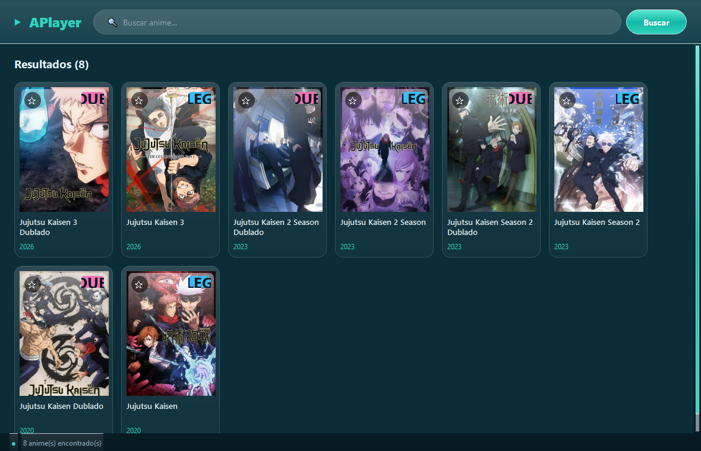

<p align="center">
  
</p>

<h1 align="center">APlayer — Media Center Desktop</h1>

Player de vídeo desktop modular em **Python + PySide6**, desenvolvido como projeto
de portfólio acadêmico com foco em **engenharia de software, multithreading e
automação de interfaces**. Tema visual **Frutiger Aero (dark mode)** — vidro fosco,
gradientes aqua, acabamento glossy, tela de carregamento e transições animadas.

> **Contexto acadêmico:** o site usado como fonte de mídia serve apenas como
> ambiente de testes de integração e *parsing* de dados públicos (estruturas de
> embed, headers de requisição e resolução de streams). O objetivo é estudar como
> softwares de *media center* tratam rede, exceções e automação de UI.



## ✨ Funcionalidades

- 🔎 **Busca** de animes via API pública (com nonce + sessão)
- 🗂️ **Grid responsivo** de posters que reflui conforme a janela
- ▶️ **Player** em janela dedicada usando **Edge WebView2** (codecs H.264/AAC nativos)
- ⭐ **Favoritos** persistentes
- 🕘 **Histórico / continuar de onde parou** (posição salva ao abrir o episódio)
- ✅ **Marcação manual** de episódios assistidos
- 🎨 Interface **Frutiger Aero dark** com vidro glossy e acentos teal

## 🧱 Arquitetura

| Módulo | Responsabilidade |
|---|---|
| `main.py` | Entry point; despacha o modo player (`--play`) |
| `ui_main.py` | Janela principal, grid responsivo, navegação |
| `scraper.py` | `GoyabuScraper` + `ScraperWorker(QThread)` — busca e parsing |
| `player_webview.py` | Janela de player Edge WebView2 (processo separado) |
| `storage.py` | Biblioteca persistente (favoritos + histórico) |
| `widgets.py` | Componentes visuais + tema Frutiger Aero |
| `utils.py` | Headers/User-Agent, config, logging, launcher |

**Multithreading:** operações de rede e *scraping* rodam em `QThread` com `Signals`,
mantendo a UI responsiva. **Reprodução:** o QtWebEngine do PyPI não inclui codecs
proprietários (H.264), então o player usa o **Edge WebView2** (presente no Windows)
lançado como processo separado para não conflitar com o event-loop do Qt.

## 🚀 Executar (a partir do código)

```bash
pip install -r requirements.txt
python main.py
```

Requer **Windows** com o **runtime do Edge WebView2** (já incluso no Windows 10/11).

## 📦 Gerar o executável (.exe)

```bash
pip install pyinstaller
pyinstaller build.spec --noconfirm --clean
# resultado em dist/APlayer/APlayer.exe
```

Ou baixe o `.exe` pronto na aba **[Releases](../../releases)** (gerado automaticamente
via GitHub Actions em cada tag `v*`).

## 🛠️ Stack

PySide6 · pywebview (Edge WebView2) · requests · PyInstaller

## 📄 Licença

[MIT](LICENSE)
